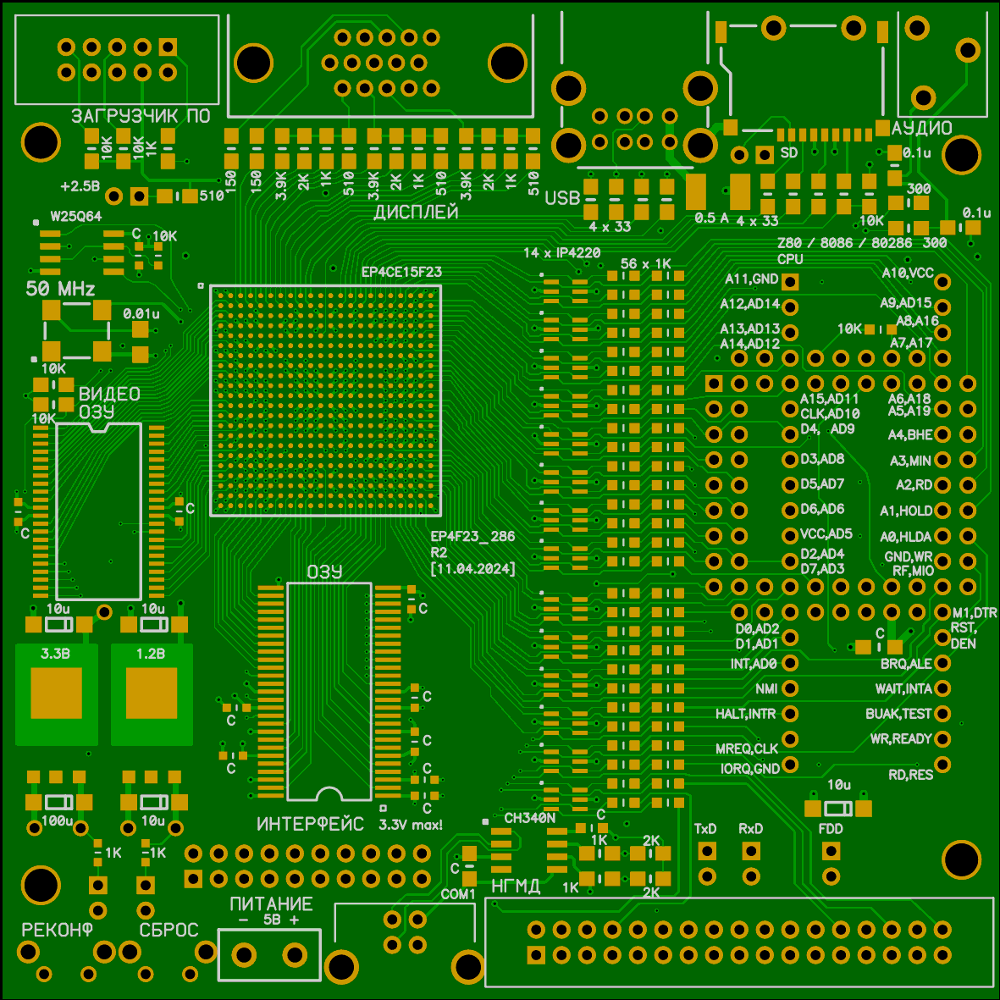
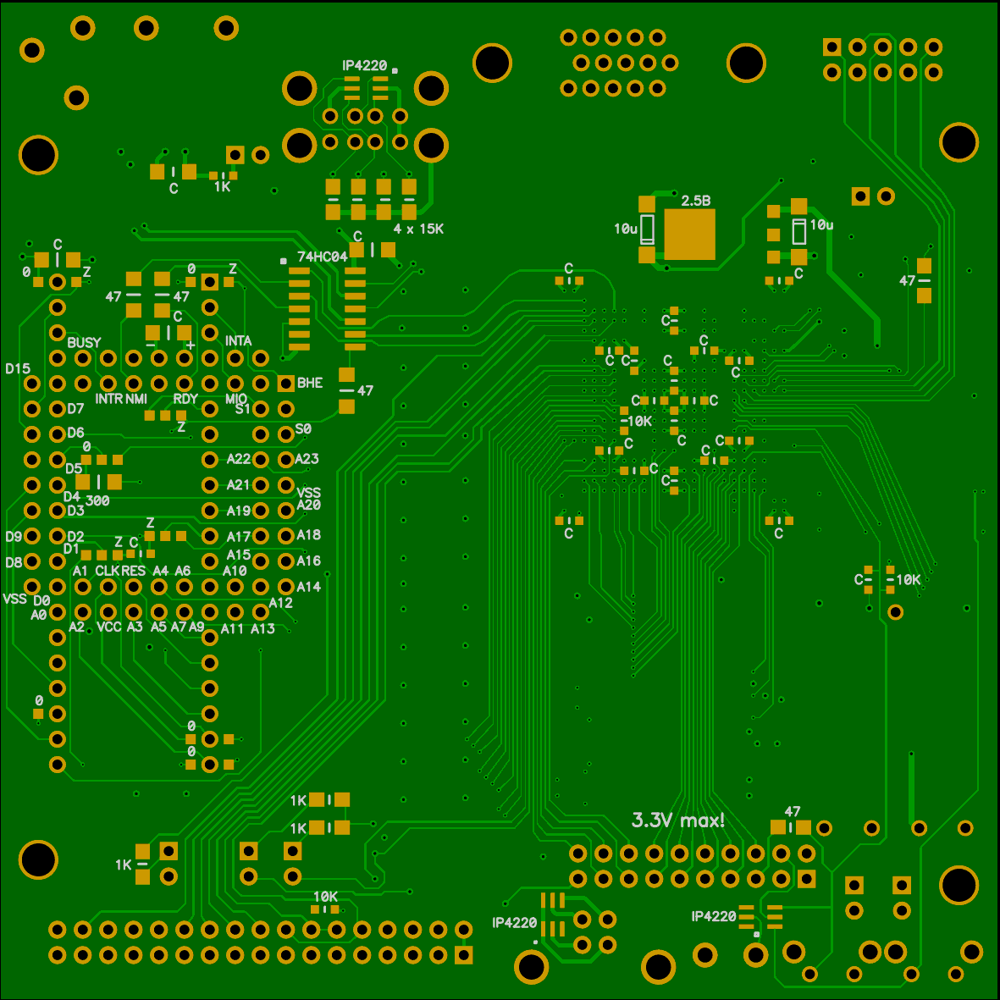
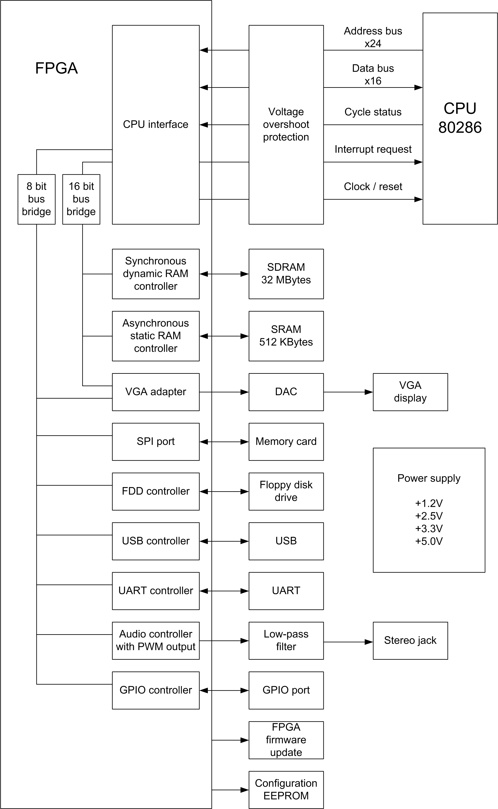

# fpga286r2
80286 Retro computer board with FPGA

### Tested software
* MSDOS 3.3 / 4.0 / 6.22
* Windows 2.0 in CGA mode

### Some tested games
* Some old CGA games
* Prince of Persia (CGA and VGA mode)

## New USB host controller

* Full-speed (12 Mbit/s) device support for fast gaming keyboards and mouses.
* Composite device support (Radio keyboard+mouse, 2-in-1 devices).
* USB PHYs are now controlled by RISC-V I/O processor. Firmware was written in C and can be easily improved.

In this version only upper USB port is connected. The lower one needs some firmware rework. Joystick and mouse report are ignored now and will be available soon.

The RISC-V core will print USB device information on a DEBUG port. If you need the DEBUG port to be controlled by main processor comment "txd" line on a RISC-V UART and uncomment "txd" line of a CPU's UART.

## BIOS
Please use this compact BIOS:

https://github.com/b-dmitry1/BIOS

## PCB
P-CAD 2006, Sprint Layout 6, and prepared for manufacturing Gerber files could be found in a "pcb" directory.

Technology:
* 4-layer PCB.
* 100x100 mm size.
* 0.2 mm min hole.
* 0.46 mm min via diameter.
* 0.127 mm min track.

It is safe to increase hole size to 0.3 mm, via to 0.63mm, and track width to 0.15 mm.

All the electronic components including FPGA (EP4CE15F23C8N) and CPU (80c286) could be found on AliExpress.

FPGA pin test is included. Check the fpga_pin_test project.

Top view:

Bottom view:

Simplified schematic diagram:

## Compiling on Windows

Please use Altera Quartus II 13.0sp1 to compile the project.

## Using disk images
Please use disk images from my e86r project:

https://github.com/b-dmitry1/e86r

Just write a FreeDos or an empty image to a SD card, mount it and add your files using File Explorer.

## Docs and manuals

* Electrical schematic diagram is in "sch" directory.
* Please check the "doc" directory.

## Disclaimer
The project is provided "as is" without any warranty. Use at your own risk.
