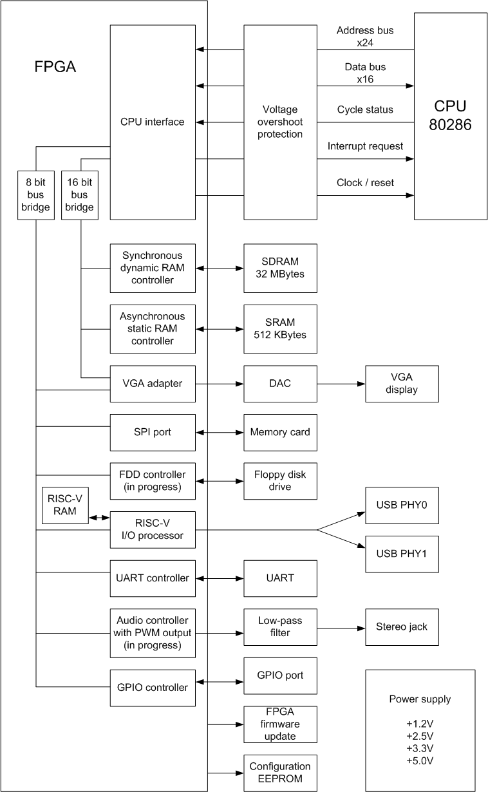

# fpga286r2
80286 Retro computer board with FPGA

### Tested software
* MSDOS 3.3 / 4.0 / 6.22
* Windows 2.0 in CGA mode

### Some tested games
* Some old CGA games
* Prince of Persia (CGA and VGA mode)

## New USB host controller almost done!

My new super-duper plug-and-play low-speed USB HOST controller is now successfully initializing keyboards and mouses.
I tried to keep it as simple as possible - now it consists of 322 lines of PHY code, and 192 lines of HID controller code.

To test it:
* Connect your mouse or keyboard to an upper USB (only low-speed and no hubs for now, sorry!).
* Connect headphones to audio jack.
* Every time you'll move you mouse or push buttons on a keyboard you'll hear clicks and bleeps - thus the controller
lets you know that a device's report has been received.

The goal is to create a fully plug-and-play HID host controller that will automatically parse device reports and
provide keydown/keyup codes and mouse events.

"ACK" response on "GET DESCRIPTOR" command:

## The FPGA - CPU interface

80286 CPU have 5 main transaction types: Memory Read, Memory Write, I/O Read, I/O Write, and an Interrupt Acknowledge.
Each cycle is identified by combination of signals S0, S1, M/IO, COD/INTA appearing on the CPU's buses.

When S0 and/or S1 goes low it is safe to fetch address and transaction type.

### Memory read

Appearing when the CPU is requesting code or reading memory. Identified by S0 = 1, S1 = 0, M/IO = 1.

We need to redirect a "read" command to RAM controller or ROM BIOS. When done, we'll send the result to the CPU's data bus.

### Memory write

Appearing when the CPU is writing to a memory. Identified by S0 = 0, S1 = 1, M/IO = 1.

We need to wait until S0 goes high and redirect a value from the CPU's data bus and a "write" command to RAM controller.

### I/O read

Appearing when the CPU is reading data from an external device. Identified by S0 = 1, S1 = 0, M/IO = 0.

We need to redirect a "read" command to a selected device. When done, we'll send the result to the CPU's data bus.

If the CPU is trying to read from a non-existing device it is better to return all one's like an original PC does.

### I/O write

Appearing when the CPU is writing to an external device. Identified by S0 = 0, S1 = 1, M/IO = 0.

We need to wait until S0 goes high and redirect a value from the CPU's data bus and a "write" command to a selected device.

### Interrupt Acknowledge

Appearing when the CPU acknowledges an interrupt. Identified by S0 = 0, S1 = 0, M/IO = 0, COD/INTA = 0.

We need to ask an interrupt controller what interrupt number is requested and send it to the CPU's data bus.

The CPU (for some reason) is performing this cycle twice. Ok, we'll repeat the number one more time.

### Ready signal

Some devices like SDRAM or SPI bus controller are working much slower than the CPU so we need to "extend" read/write cycles.

If the requested device cannot execute command immediately - it indicates "not ready" state by pulling CPU's "ready" signal to an inactive state.
The CPU can wait for the tranaction to end indefinitely. The "ready" signal should be synchronized to the CPU's clock.

A small program in the "Main.v" file performs all this actions.

### System reset

On power-up or by user's request (push the button) the CPU's reset procedure is performed.
The CPU will do it's own initialization routines for about 50 clock cycles, and we should keep the clock running for this period.

After that, the CPU will fill its instruction queue by performing 4 x 16 bit reads from address 0xFFFFF0. This address is a mirror for 0x0FFFF0 where the system BIOS lives.
A very first command usually located in this address in the BIOS is a long jump to a BIOS's entry point, but you can place there any command you want - the CPU will execute it in an usual way.

## BIOS
Please use this compact BIOS:

https://github.com/b-dmitry1/BIOS

## PCB
P-CAD 2006, Sprint Layout 6, and prepared for manufacturing Gerber files could be found in a "pcb" directory.

Technology:
* 4-layer PCB.
* 100x100 mm size.
* 0.2 mm min hole.
* 0.46 mm min via diameter.
* 0.127 mm min track.

I have paid only $7 for 5 PCBs on jlcpcb.com.
It is safe to increase hole size to 0.3 mm, via to 0.63mm, and track width to 0.15 mm.

All the electronic components including FPGA (EP4CE15F23C8N) and CPU (80c286) could be found on AliExpress.

Top view:

Bottom view:

Simplified schematic diagram:

## Compiling on Windows

Please use Altera Quartus II 13.0sp1 to compile the project.

## Using disk images
Please use disk images from my e86r project:

https://github.com/b-dmitry1/e86r

Just write a FreeDos or an empty image to a SD card, mount it and add your files using File Explorer.

## Known problems
* USB support is in progress. Working USB module could be found in my "V188" project.
* No return from protected mode due to absence of 70h port emulation.
* VGA virtual resolution (panning) calculation may be wrong for some games.
* VGA palette errors

## Disclaimer
The project is provided "as is" without any warranty. Use at your own risk.

Due to lack of time, I made the PCB without any schematic diagrams, sorry.
If you really need schematic diagram - contact me and I'll create it.
