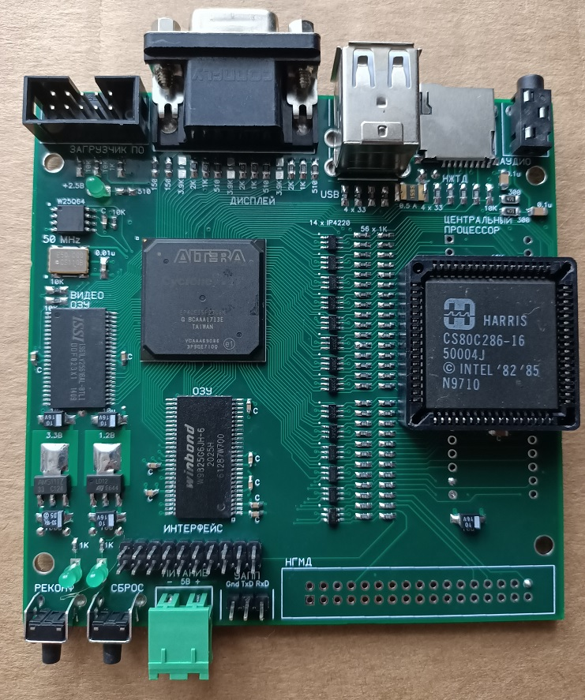
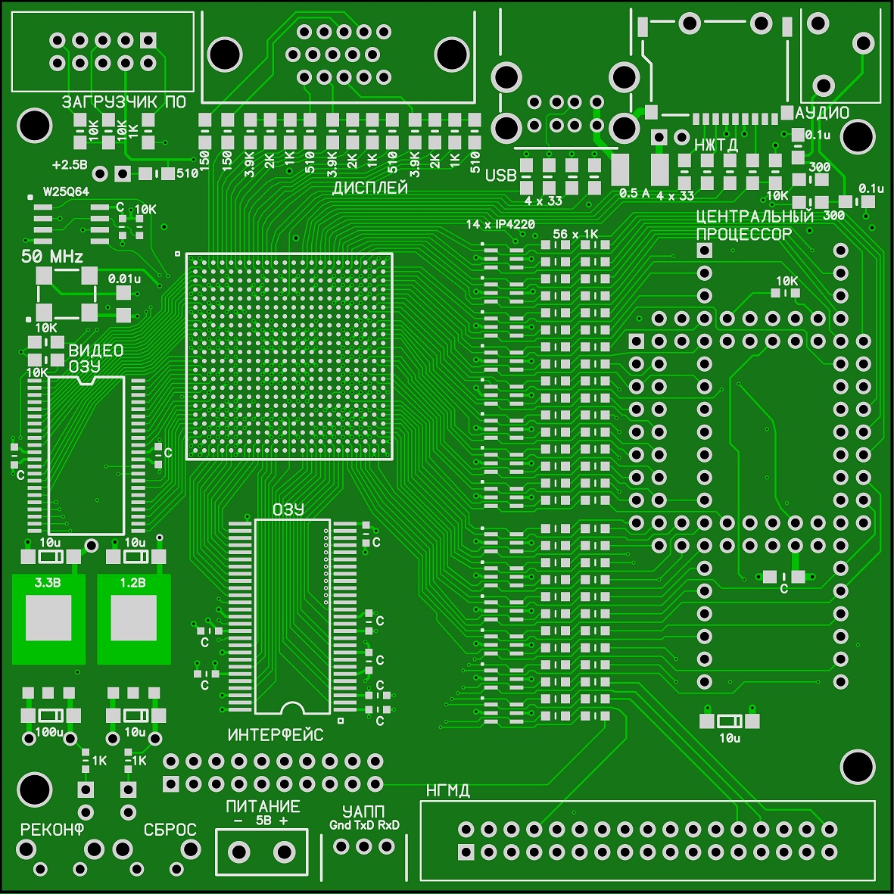
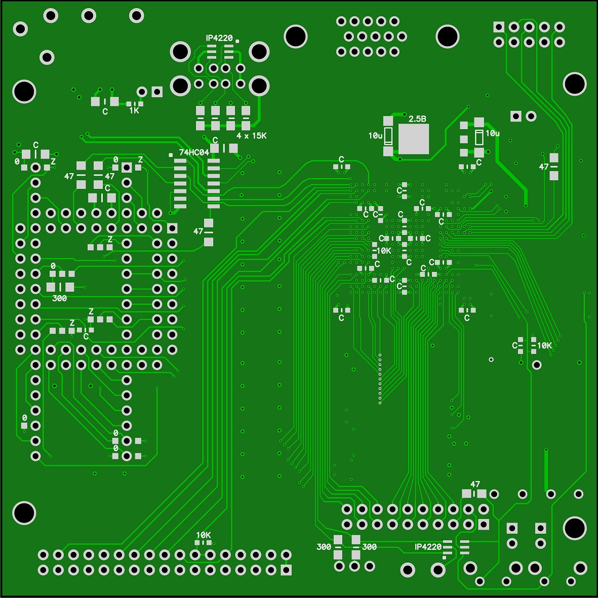
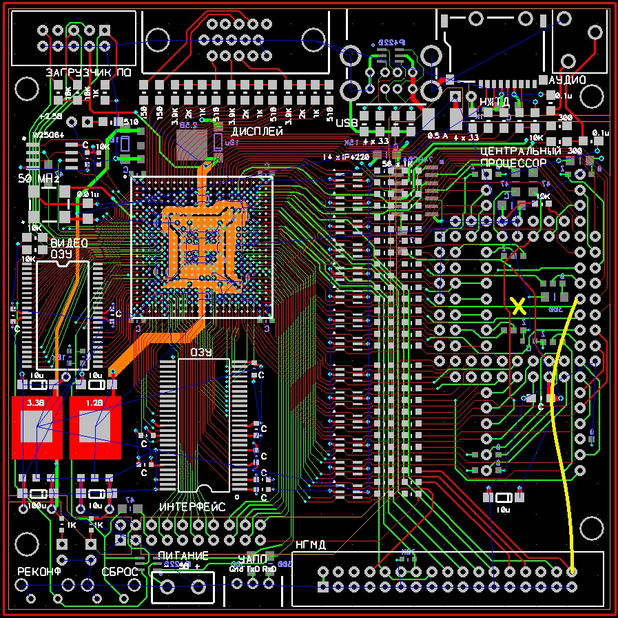

# PCB
P-CAD 2006, Sprint Layout 6, and prepared for manufacturing Gerber files could be found in a "pcb" directory.

The board was designed to support 3 different CPUs:
* Zilog Z80
* 8086
* 80286

The CPUs are not pin-compatible so there are some jumpers near to the CPU that routing power/signals:
* Jumpers marked by "Z" should be shorted if the CPU is Z80.
* Jumpers marked by "0" should be shorted if the CPU is 8086.
* Not marked jumpers should be shorted if the CPU is Z80 and there is no "Z" jumper on an opposite side (for 3-position jumpers).
* Not marked jumpers should be shorted if the CPU is 8086 and there is no "0" jumper on an opposite side (for 3-position jumpers).
* Not marked jumpers should be shorted if the CPU is 80286.
   
### Technology
* 4-layer PCB.
* 100x100 mm size.
* 0.2 mm min hole.
* 0.46 mm min via diameter.
* 0.127 mm min track.

I have paid only $7 for 5 PCBs on jlcpcb.com.
It is safe to increase hole size to 0.3 mm, via to 0.63mm, and track width to 0.15 mm.

All the electronic components including FPGA (EP4CE15F23C8N) and CPU (80c286) could be found on AliExpress.

Top view:

Bottom view:

Please note that the PCB should be slightly corrected to make it work with a 286 CPU.
There are 2 modifications:
* 1 track should be cut at the location indicated by the yellow cross.
* 1 wire should be added as shown in yellow.

If you want to use Z80 or 8086 CPU please re-route tracks on DIP40 pins 27 and 28. They are connected there by mistake.
The FPGA-CPU bridge located in the "Main.v" file also should be changed to provide support of this CPUs.
They are incompatible so is not interchangeable!

